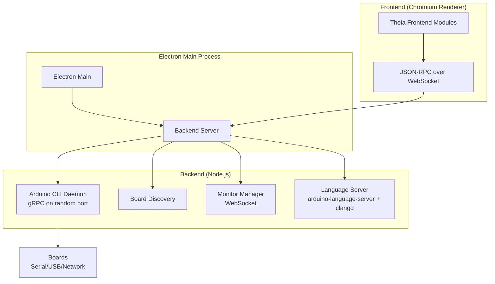
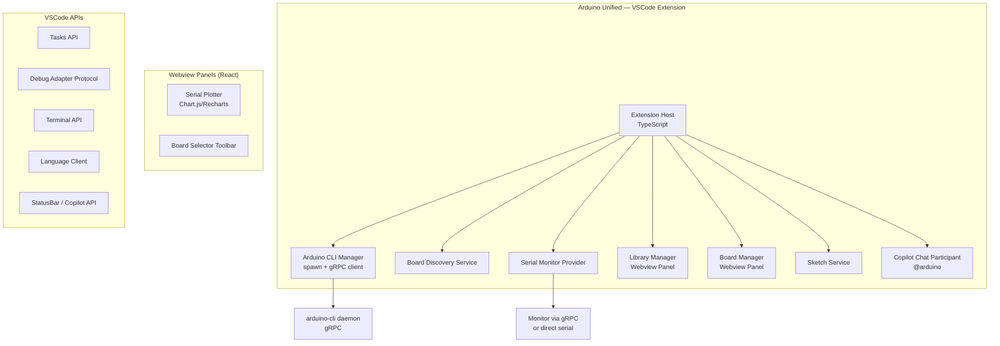

# Arduino Unified — Research & Implementation Plan

> **Project:** Arduino Unified — A modern VSCode extension for Arduino development with AI-powered features  
> **License:** GNU General Public License v3.0 (GPL-3.0)  
> **Target:** Visual Studio Code Extension  
> **AI Integration:** VSCode built-in GitHub Copilot Chat API  
> **Cloud Integration:** None (intentionally excluded)

## Phase 1: Arduino IDE Reverse Engineering & Analysis

### 1. Architecture Overview

The Arduino IDE 2.x is a complete rewrite of the original 1.x IDE. It is built on three major pillars:

| Layer | Technology | Purpose |
|---|---|---|
| **Shell** | Electron 30.x | Desktop window management, OS integration, packaging |
| **Framework** | Eclipse Theia 1.57 | VSCode-like IDE framework (editor, panels, extensions, DI) |
| **Board Tooling** | Arduino CLI (Go binary) | All board operations via gRPC daemon |

> [!IMPORTANT]
> The **fundamental insight** is that the Arduino IDE is essentially a **thin UI wrapper** around `arduino-cli`. Almost every hardware operation (compile, upload, board detection, library management, platform installation) is delegated to the CLI binary via **gRPC**. This is the key to replicating its functionality.

---

### 2. Core Workflows

#### 2.1 Compilation (Verify/Compile)

**Flow:** `User clicks Verify` → [verify-sketch.ts](file:///Volumes/Samsung/Repositories/temp/arduino-ide-antigravity/arduino-ide-extension/src/browser/contributions/verify-sketch.ts) → gRPC `Compile` RPC → `arduino-cli`

1. Frontend gathers: sketch path, FQBN (Fully Qualified Board Name), compiler warnings level, verbose flag, debug optimization flag, source overrides
2. Backend creates `CompileRequest` protobuf message via [core-service-impl.ts](file:///Volumes/Samsung/Repositories/temp/arduino-ide-antigravity/arduino-ide-extension/src/node/core-service-impl.ts)
3. Sends streaming gRPC call to `arduino-cli daemon` → receives `CompileResponse` stream with stdout/stderr and `CompileSummary`
4. Result includes: `buildPath`, `usedLibraries`, `executableSectionsSize` (flash/RAM usage), `buildProperties`

#### 2.2 Upload to Board

**Flow:** `User clicks Upload` → [upload-sketch.ts](file:///Volumes/Samsung/Repositories/temp/arduino-ide-antigravity/arduino-ide-extension/src/browser/contributions/upload-sketch.ts) → auto-verify (optional) → gRPC `Upload` RPC

1. Optionally compiles first (`arduino.upload.autoVerify` preference)
2. Pauses serial monitor if connected to the same port
3. Creates `UploadRequest` with: sketch path, FQBN, port (address + protocol), programmer, user fields, verbose/verify flags
4. Streaming gRPC call handles progress, stdout/stderr
5. After upload: detects port changes (some boards change ports during upload), reconnects monitor
6. Also supports: `UploadUsingProgrammer` and `BurnBootloader`

#### 2.3 Board Discovery & Detection

**Service:** [board-discovery.ts](file:///Volumes/Samsung/Repositories/temp/arduino-ide-antigravity/arduino-ide-extension/src/node/board-discovery.ts)

- Uses gRPC `BoardListWatch` streaming RPC for real-time port detection
- Detects boards via serial (USB), network (mDNS), and other protocols
- Each detected port has: `address`, `protocol`, `protocolLabel`, `properties`, `hardwareId`
- Matched boards are provided with: `name`, `fqbn`
- Discovery is stopped during uploads/installations and restarted after

#### 2.4 Library Management

**Service:** [library-service-impl.ts](file:///Volumes/Samsung/Repositories/temp/arduino-ide-antigravity/arduino-ide-extension/src/node/library-service-impl.ts)

| Operation | gRPC RPC |
|---|---|
| Search libraries | `LibrarySearch` + `LibraryList` |
| List installed | `LibraryList` |
| Install | `LibraryInstall` (streaming with progress) |
| Install from ZIP | `ZipLibraryInstall` |
| Uninstall | `LibraryUninstall` |
| Resolve deps | `LibraryResolveDependencies` |

- Libraries filtered by: type (Arduino, Partner, Recommended, Contributed, Retired), topic, installed/updatable status
- Board discovery is stopped during install/uninstall operations

#### 2.5 Board Platform (Core) Management

**Service:** [boards-service-impl.ts](file:///Volumes/Samsung/Repositories/temp/arduino-ide-antigravity/arduino-ide-extension/src/node/boards-service-impl.ts)

| Operation | gRPC RPC |
|---|---|
| Search platforms | `PlatformSearch` |
| Install platform | `PlatformInstall` (streaming) |
| Uninstall platform | `PlatformUninstall` |
| Board details | `BoardDetails` |
| Board search | `BoardSearch` / `BoardListAll` |
| Check debug | `IsDebugSupported` |

- Platforms have: id (e.g., `arduino:avr`), versions, board list, types
- Additional board manager URLs for 3rd-party platforms (e.g., ESP32)

#### 2.6 Serial Monitor & Plotter

**Service:** [monitor-manager.ts](file:///Volumes/Samsung/Repositories/temp/arduino-ide-antigravity/arduino-ide-extension/src/node/monitor-manager.ts) → [monitor-service.ts](file:///Volumes/Samsung/Repositories/temp/arduino-ide-antigravity/arduino-ide-extension/src/node/monitor-service.ts)

- **Architecture:** Backend WebSocket server per monitor ↔ Frontend WebSocket client
- Uses gRPC `Monitor` streaming RPC to communicate with the board via the CLI's pluggable monitors
- Supports configurable settings: baud rate, data bits, stop bits, parity, DTR/RTS (via `PluggableMonitorSettings`)
- Monitor is paused during uploads, resumed after
- **Serial Plotter:** Embedded React webapp (`arduino-serial-plotter-webapp` npm package) served by the backend

#### 2.7 Sketch Management

**Service:** [sketches-service-impl.ts](file:///Volumes/Samsung/Repositories/temp/arduino-ide-antigravity/arduino-ide-extension/src/node/sketches-service-impl.ts)

- Sketches follow Arduino [sketch specification](https://arduino.github.io/arduino-cli/latest/sketch-specification/): folder name = main `.ino` file name
- Create new sketch (temp dir → save to sketchbook)
- Load, copy, rename, archive sketches (all via gRPC `LoadSketch`, `ArchiveSketch`)
- Recent sketches tracking (JSON file in config dir)
- Supports: `.ino`, `.pde`, `.c`, `.cpp`, `.h`, `.hpp`, `.S` and more

#### 2.8 Arduino CLI Daemon

**Service:** [arduino-daemon-impl.ts](file:///Volumes/Samsung/Repositories/temp/arduino-ide-antigravity/arduino-ide-extension/src/node/arduino-daemon-impl.ts)

- Spawns `arduino-cli daemon --port 0` as child process on app start
- CLI listens on a random port, reports port via JSON stdout
- gRPC client connects to this port
- **Core Client Provider** ([core-client-provider.ts](file:///Volumes/Samsung/Repositories/temp/arduino-ide-antigravity/arduino-ide-extension/src/node/core-client-provider.ts)):
  - Creates gRPC instance (`CreateRequest`)
  - Initializes with `InitRequest` (loads platform/library indexes)
  - Auto-downloads missing indexes before first init
  - Handles config changes (additional URLs → re-index, sketchbook change → re-init)

#### 2.9 Configuration

**Service:** [config-service-impl.ts](file:///Volumes/Samsung/Repositories/temp/arduino-ide-antigravity/arduino-ide-extension/src/node/config-service-impl.ts)

- Reads/writes `arduino-cli.yaml` config file
- Key settings: `directories.data`, `directories.user` (sketchbook), `board_manager.additional_urls`, `network.proxy`, `locale`
- Updates CLI daemon configuration at runtime via gRPC `SettingsSetValue`

#### 2.10 Additional Features

| Feature | Implementation |
|---|---|
| **Code Formatting** | [clang-formatter.ts](file:///Volumes/Samsung/Repositories/temp/arduino-ide-antigravity/arduino-ide-extension/src/node/clang-formatter.ts) — Uses `clang-format` binary with Arduino-specific config |
| **Language Server** | External: `arduino-language-server` + `clangd` 14.0 — provides IntelliSense, go-to-definition, hover, errors |
| **Debugging** | [debug.ts](file:///Volumes/Samsung/Repositories/temp/arduino-ide-antigravity/arduino-ide-extension/src/browser/contributions/debug.ts) — Uses `cortex-debug` VSCode extension + CLI `debug` command |
| **Firmware Uploader** | [arduino-firmware-uploader-impl.ts](file:///Volumes/Samsung/Repositories/temp/arduino-ide-antigravity/arduino-ide-extension/src/node/arduino-firmware-uploader-impl.ts) — Separate `arduino-fwuploader` binary for WiFi module firmware |
| **Auto-update** | Electron auto-updater with S3 bucket distribution |
| **Cloud Sketches** | Authentication via Auth0, Arduino Cloud sync |
| **3rd Party Themes** | VSCode `.vsix` theme compatibility (loaded as Theia plugins) |
| **i18n** | 20+ languages via Transifex, NLS system |
| **Examples** | Built-in examples + library examples loaded from CLI |
| **Board Config Options** | Per-board config options (CPU speed, flash size, etc.) persisted in `BoardsDataStore` |

> [!NOTE]
> **Features excluded from Arduino Unified:** Cloud Sketches (Auth0/Arduino Cloud sync) and Electron auto-updater are not applicable. Updates will be handled via the VSCode Marketplace. Themes are natively supported by VSCode.

---

### 3. External Dependencies (Binary Tools)

| Tool | Version | Purpose |
|---|---|---|
| `arduino-cli` | 1.4.1 | Core: compile, upload, boards, libraries, config, debug |
| `arduino-fwuploader` | 2.4.1 | WiFi firmware flashing |
| `arduino-language-server` | Commit `05ec308` | C/C++/Arduino IntelliSense |
| `clangd` | 14.0.0 | C/C++ language server backend |
| `clang-format` | (bundled) | Code formatting |

> [!IMPORTANT]
> All these tools are **downloaded at build time** via scripts in [arduino-ide-extension/scripts/](file:///Volumes/Samsung/Repositories/temp/arduino-ide-antigravity/arduino-ide-extension/scripts/). The download URLs are platform-specific (Windows/macOS/Linux, x64/arm64).

### 4. Identified Limitations & Pain Points

1. **Electron overhead:** ~300MB+ bundle, high memory usage, slow startup
2. **Theia framework complexity:** Heavy abstraction layer with inversify DI, complex module system
3. **No AI features:** No code completion AI, no error explanation, no code generation
4. **Single-window model:** Each sketch opens in a separate window
5. **Limited extension ecosystem:** Uses Theia's VSCode extension compatibility (subset of VSCode API)
6. **gRPC coupling:** Version mismatch between IDE and CLI can break communication
7. **Build system:** Complex monorepo with Lerna, Yarn workspaces, webpack, multiple build targets

---

## Phase 2: Implementation Plan for Arduino Unified

### Project Identity

| Property | Value |
|---|---|
| **Name** | Arduino Unified |
| **Type** | VSCode Extension |
| **Extension ID** | `arduino-unified` |
| **Display Name** | Arduino Unified |
| **License** | GNU General Public License v3.0 (GPL-3.0) |
| **AI** | VSCode built-in GitHub Copilot (Chat Participant API) |
| **Distribution** | VSCode Marketplace + GitHub Releases |
| **Cloud Features** | None — fully offline-capable, no Arduino Cloud dependency |

---

### Architecture

> [!IMPORTANT]
> Arduino Unified is a **VSCode Extension** with custom Webview-based UI for Arduino-specific panels (board selector, serial monitor/plotter, library/platform managers). This gives us the best editor in the world (Monaco), full Copilot integration, the entire VSCode extension ecosystem, and beautiful custom UIs where needed.

### Feature Breakdown & Implementation

---

#### Module 1: Core — Arduino CLI Integration

**Files:** `src/cli/daemon.ts`, `src/cli/grpc-client.ts`, `src/cli/downloader.ts`

- [ ] Auto-download `arduino-cli` for the user's platform on first activation
- [ ] Spawn `arduino-cli daemon` as a managed child process
- [ ] Implement gRPC client using `@grpc/grpc-js` + generated protobuf types
- [ ] Handle CLI lifecycle: start, stop, restart, config changes
- [ ] Implement `CoreClientProvider` pattern: Create → Init → Ready with index download fallback

---

#### Module 2: Compile & Upload

**Files:** `src/commands/compile.ts`, `src/commands/upload.ts`

- [ ] `Arduino: Compile Sketch` command with progress reporting (VSCode Progress API)
- [ ] `Arduino: Upload Sketch` command with auto-verify option
- [ ] `Arduino: Upload Using Programmer` command
- [ ] `Arduino: Burn Bootloader` command
- [ ] `Arduino: Export Compiled Binary` command
- [ ] Output channel for compiler output with clickable error locations
- [ ] Error parsing: map CLI error output to VSCode Diagnostics (Problems panel)
- [ ] Status bar item showing compile/upload progress
- [ ] **🤖 AI Feature:** "Explain compile error" action on diagnostics → sends error context to AI

---

#### Module 3: Board Discovery & Selection

**Files:** `src/boards/discovery.ts`, `src/boards/selector.ts`, `src/boards/config-store.ts`

- [ ] Real-time board detection via gRPC `BoardListWatch`
- [ ] Status bar board selector (`Board @ Port`) with quick pick dropdown
- [ ] Board configuration options UI (webview panel for complex configs)
- [ ] Per-board settings persistence (selected programmer, config options)
- [ ] FQBN management with config option appending
- [ ] Support for additional board manager URLs

---

#### Module 4: Library Manager

**Files:** `src/libraries/manager.ts`, `src/libraries/webview-panel.tsx`

- [ ] React-based Webview panel with: search, filter (by type/topic), install, update, remove
- [ ] Library dependency resolution before install
- [ ] Include library in sketch (auto-add `#include` directive)
- [ ] ZIP library installation
- [ ] Show library examples in Explorer
- [ ] **🤖 AI Feature:** "Suggest libraries for my project" based on code analysis

---

#### Module 5: Board/Platform Manager

**Files:** `src/platforms/manager.ts`, `src/platforms/webview-panel.tsx`

- [ ] React-based Webview panel: search, install, update, remove board packages
- [ ] Support for 3rd party board manager URLs (ESP32, STM32, etc.)
- [ ] Platform version selection
- [ ] First-run installer for common platforms

---

#### Module 6: Serial Monitor & Plotter

**Files:** `src/monitor/serial-monitor.ts`, `src/monitor/plotter.tsx`

- [ ] Serial Monitor as VSCode Terminal (pseudo-terminal) or Webview panel
- [ ] Configurable: baud rate, line ending, timestamp, autoscroll
- [ ] Send/receive data with input field
- [ ] Auto-disconnect during uploads, auto-reconnect after
- [ ] Serial Plotter as React Webview panel with real-time charting
- [ ] **🤖 AI Feature:** "Explain serial output" — analyze patterns in serial data

---

#### Module 7: Sketch Management

**Files:** `src/sketches/sketch-service.ts`, `src/sketches/commands.ts`

- [ ] `Arduino: New Sketch` — create in temp, move on save
- [ ] Open sketch with proper file association (`.ino`)
- [ ] Sketch validation (folder name = main file name)
- [ ] Recent sketches tracking and quick pick
- [ ] Archive sketch (zip)
- [ ] Save as / Copy sketch
- [ ] Built-in examples browser (tree view)
- [ ] Customizable new sketch template (`inoBlueprint`)

---

#### Module 8: Language Support (IntelliSense)

**Files:** `src/language/language-client.ts`, `src/language/ino-support.ts`

- [ ] Bundle or auto-download `arduino-language-server` + `clangd`
- [ ] LSP client integration via VSCode Language Client
- [ ] Syntax highlighting for `.ino` files (TextMate grammar or semantic tokens)
- [ ] Code completion, go-to-definition, hover, find references
- [ ] Compile-time source override for live errors
- [ ] **🤖 AI Feature:** Enhanced Arduino-specific completions (suggest `pinMode`, `digitalWrite` patterns, etc.)

---

#### Module 9: Debugging

**Files:** `src/debug/debug-provider.ts`

- [ ] Debug Adapter Provider using `cortex-debug` extension
- [ ] Auto-generate `launch.json` from CLI `debug --info`
- [ ] "Optimize for Debug" toggle
- [ ] Check debug support before enabling button
- [ ] **🤖 AI Feature:** "Explain debug state" — describe variable values and execution context

---

#### Module 10: Code Formatting

**Files:** `src/format/formatter.ts`

- [ ] Register DocumentFormattingProvider for `.ino`/`.cpp`/`.h` files
- [ ] Use `clang-format` binary with Arduino-standard configuration
- [ ] Support user `.clang-format` files (sketch folder → config dir → data dir → default)

---

#### Module 11: AI Features via GitHub Copilot (NEW — not in original IDE)

**Files:** `src/ai/chat-participant.ts`, `src/ai/code-actions.ts`, `src/ai/tools.ts`

> [!NOTE]
> All AI features use the **VSCode built-in GitHub Copilot Chat API** (`vscode.chat`, `vscode.lm`). Users need an active Copilot subscription. AI features degrade gracefully if Copilot is not available.

- [ ] **Copilot Chat Participant** (`@arduino`) using `vscode.chat.createChatParticipant`:
  - "How do I use sensor X with board Y?"
  - "Generate code for controlling a servo motor"
  - "Explain this Arduino code"
  - "Fix this compile error: [error message]"
  - "What library do I need for [component]?"
  - System prompt includes Arduino context: current board FQBN, installed libraries, pin mappings
- [ ] **Chat Tools** (`vscode.lm.registerTool`):
  - `arduino_compile` — compile current sketch and return errors
  - `arduino_board_info` — get current board details and pin mappings
  - `arduino_library_search` — search the library registry
  - `arduino_serial_read` — read recent serial monitor output
- [ ] **Quick Fix Code Actions:**
  - Suggest fixes for common Arduino mistakes
  - Auto-include missing libraries
  - Suggest `pinMode` for undeclared pins
- [ ] **Error Explanation:**
  - Right-click on compile error → "Explain with Copilot"
  - Provides beginner-friendly explanation and fix suggestions
- [ ] **Serial Data Analysis:**
  - Analyze patterns in serial monitor output
  - Suggest data visualization approaches
- [ ] **Wiring Diagram Generation:**
  - Describe connections in chat → generate ASCII/SVG wiring diagram
- [ ] **Project Templates:**
  - "Create a project for [description]" → generates complete sketch with comments

---

#### Module 12: Configuration & Settings

**Files:** `src/config/settings.ts`, `src/config/cli-config.ts`

- [ ] VSCode settings for all Arduino Unified preferences (namespaced under `arduinoUnified.*`):
  - `arduinoUnified.cli.path` — custom CLI path
  - `arduinoUnified.compile.verbose`, `arduinoUnified.compile.warnings`
  - `arduinoUnified.upload.verbose`, `arduinoUnified.upload.verify`, `arduinoUnified.upload.autoVerify`
  - `arduinoUnified.sketchbook.path`
  - `arduinoUnified.boardManager.additionalUrls`
  - `arduinoUnified.monitor.baudRate`, `arduinoUnified.monitor.lineEnding`
- [ ] CLI config file management (`arduino-cli.yaml`)
- [ ] Network proxy configuration

---

### Technology Stack

| Component | Technology |
|---|---|
| Extension runtime | TypeScript 5.x, VSCode Extension API |
| gRPC client | `@grpc/grpc-js`, `google-protobuf` |
| Webview panels | React 18, Vite (build), CSS Modules or Tailwind |
| Charting (plotter) | Recharts or lightweight canvas library |
| AI integration | VSCode built-in Copilot Chat API (`vscode.chat`, `vscode.lm`) |
| Testing | Vitest (unit), VSCode Extension Test runner (`@vscode/test-electron`) |
| CI/CD | GitHub Actions |
| Packaging | `vsce` for marketplace, GitHub releases |
| License | GNU GPL v3.0 |

---

### Verification Plan

#### Automated Tests
- Unit tests for gRPC client wrapper, sketch validation, FQBN parsing
- Integration tests with real `arduino-cli` daemon (compile/upload with simulator)
- Webview component tests with React Testing Library
- E2E tests using `@vscode/test-electron`

#### Manual Verification
- Test with physical Arduino Uno, Mega, Nano, ESP32, ESP8266 boards
- Verify library install/update/remove workflows
- Test serial monitor at various baud rates
- Test debug session with cortex-debug compatible boards
- Cross-platform testing: macOS, Windows, Linux (Ubuntu)

---

## Decisions Log

| Decision | Resolution |
|---|---|
| **Platform** | ✅ VSCode Extension |
| **Name** | ✅ Arduino Unified |
| **License** | ✅ GNU GPL v3.0 |
| **AI Provider** | ✅ VSCode built-in GitHub Copilot Chat API |
| **Arduino Cloud** | ❌ Excluded — no cloud features, fully offline-capable |

---

*Ready for implementation. Awaiting user approval to begin.*
