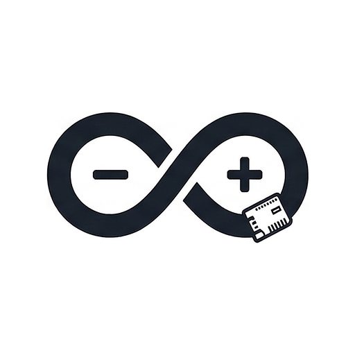
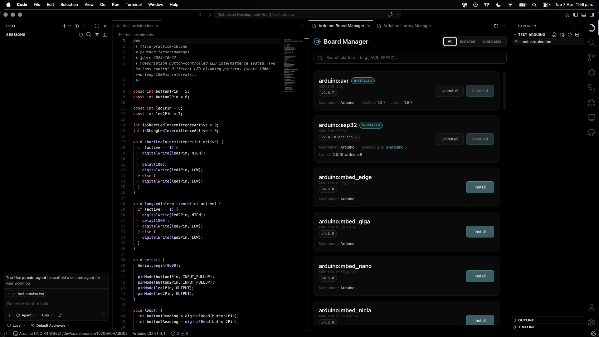
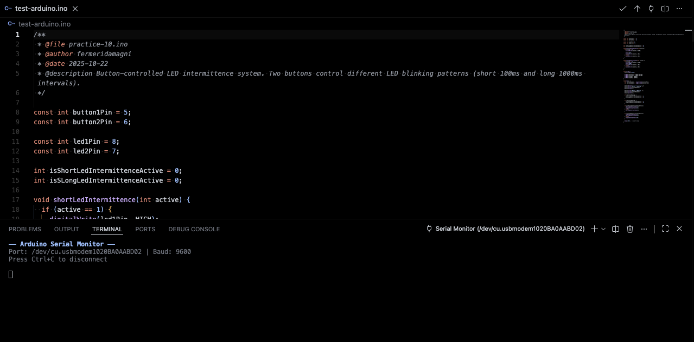
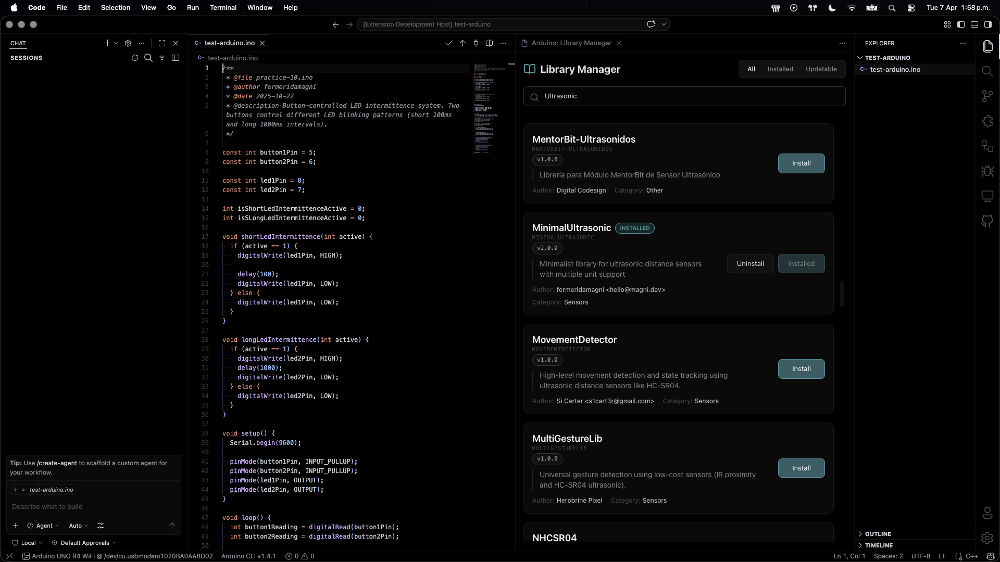
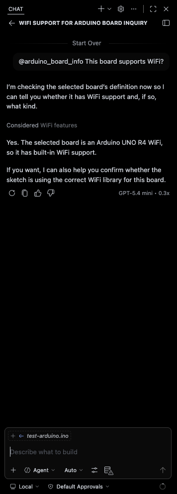

# Arduino Unified

<p align="center">
  
</p>

<p align="center">
  <strong>The Complete Arduino Development Environment for VS Code</strong><br>
  Out-of-the-box tooling • AI-powered assistance • Modern developer experience
</p>

<p align="center">
  <a href="https://github.com/fermeridamagni/arduino-unified"></a>
  <a href="https://marketplace.visualstudio.com/items?itemName=fermeridamagni.arduino-unified"></a>
  <a href="https://marketplace.visualstudio.com/items?itemName=fermeridamagni.arduino-unified"></a>
</p>

---

## ✨ What is Arduino Unified?

**Arduino Unified** streamlines your Arduino workflow by automating the installation of the official toolchain—including **Arduino CLI**, **Language Server**, and **Clangd**—providing a true out-of-the-box experience. No more fragmented extensions or complex configurations; just pure, efficient coding for your hardware projects.

Built on the same proven foundation as Arduino IDE 2.x (gRPC + arduino-cli daemon), Arduino Unified brings modern development practices and AI-powered assistance directly into VS Code.

### 🎯 Key Highlights

- **🚀 Zero Configuration** - Auto-downloads and manages the entire Arduino toolchain
- **🤖 AI-Powered** - GitHub Copilot integration with Arduino-specific tools
- **📡 Real-time Board Discovery** - Automatic detection of connected boards
- **📊 Serial Plotter** - Beautiful data visualization for sensor readings
- **🎨 Modern UI** - React-based webviews for library/platform management
- **🔌 Offline-First** - No cloud dependency, fully functional locally
- **🌐 Universal Support** - Official Arduino, ESP32, ESP8266, STM32, and more

---

## 🚀 Features

### Core Development Tools

#### ⚡ Compile & Upload

- One-click sketch compilation with configurable warning levels
- Direct upload to board or via programmer
- Bootloader burning support
- Binary export for production
- Memory usage analysis (Flash/RAM)
- Real-time compilation output

#### 🔍 Board Management

- **Real-time board discovery** - Automatic detection via USB/Serial/Network
- Status bar board selector with quick switching
- Support for all Arduino-compatible boards
- Custom board configuration (CPU speed, variants, etc.)
- FQBN (Fully Qualified Board Name) support

#### 📚 Library & Platform Management

- Beautiful webview interface for library search
- One-click library installation with dependency resolution
- Platform (core) installation for 3rd-party boards
- Automatic library updates
- Configurable board manager URLs

#### 🖥️ Serial Communication

- **Serial Monitor** - Real-time serial communication in VS Code terminal
- **Serial Plotter** - Live data visualization with Chart.js
- Configurable baud rates (300 - 921600)
- Multiple line ending options
- Timestamp support
- Auto-scroll and buffer management

#### 🐛 Debugging Support

- Integration with hardware debuggers (JTAG, SWD)
- Seamless cortex-debug integration
- Optimize for debug compilation option
- Check debug support for selected board

### AI-Powered Assistance

#### 🤖 @arduino Chat Participant

Ask questions and get Arduino-specific help directly in VS Code:

```txt
@arduino How do I read from a DHT22 temperature sensor?
@arduino Why is my sketch using so much memory?
@arduino Explain this compilation error
```

The AI assistant has context about:

- Your current board and FQBN
- Selected port and connection status
- Installed libraries
- Recent compilation errors
- Serial monitor output

#### 🛠️ AI Language Model Tools

The AI can directly invoke Arduino operations:

- **Compile sketches** and analyze errors
- **Query board information** (pins, programmers, config)
- **Search libraries** in the Arduino registry
- **Read serial output** for debugging assistance

#### 💡 Smart Code Actions

- Auto-add missing `#include` directives
- Suggest `pinMode()` calls for undeclared pins
- "Explain Error with Copilot" for compilation errors
- Context-aware quick fixes

### Language Support

- Syntax highlighting for `.ino` and `.pde` files
- IntelliSense and auto-completion
- Arduino keyword documentation on hover
- Code formatting with clang-format
- Error diagnostics in Problems panel

---

## 📦 Installation

### From VS Code Marketplace

1. Open VS Code
2. Go to Extensions (Ctrl+Shift+X / Cmd+Shift+X)
3. Search for "Arduino Unified"
4. Click Install

### First Launch

On first activation, Arduino Unified will:

1. Prompt to download Arduino CLI (if not already installed)
2. Initialize the Arduino environment
3. Download board indexes and library lists
4. Start the gRPC daemon for fast communication

**That's it!** You're ready to start coding.

---

## 🎓 Getting Started

### 1. Create a New Sketch

**Command Palette** → `Arduino Unified: New Sketch`

Or use the default template in settings:

```json
{
  "arduinoUnified.sketch.template": "void setup() {\n  Serial.begin(9600);\n}\n\nvoid loop() {\n  Serial.println(\"Hello, Arduino!\");\n  delay(1000);\n}\n"
}
```

### 2. Select Your Board

Click the board selector in the status bar → Choose your board and port

Or use **Command Palette** → `Arduino Unified: Select Board & Port`

### 3. Compile Your Sketch

Click the ✓ icon in the editor title bar

Or use **Command Palette** → `Arduino Unified: Compile Sketch`

### 4. Upload to Board

Click the ↑ icon in the editor title bar

Or use **Command Palette** → `Arduino Unified: Upload Sketch`

### 5. Open Serial Monitor

Click the 🔌 icon in the editor title bar

Or use **Command Palette** → `Arduino Unified: Open Serial Monitor`

---

## 🤖 Using AI Features

### Chat with @arduino

Open GitHub Copilot Chat (Ctrl+Alt+I / Cmd+Option+I) and type:

```txt
@arduino I'm getting a "not enough memory" error. How can I optimize my sketch?
```

The AI has full context of your project and can:

- Analyze your code
- Compile and diagnose errors
- Suggest optimizations
- Find relevant libraries
- Debug serial output issues

### AI-Powered Debugging

When you get a compilation error:

1. Hover over the error in the Problems panel
2. Click "Explain Error with Copilot"
3. Get an AI explanation with suggested fixes

### Ask for Library Recommendations

```txt
@arduino What's the best library for reading GPS data?
```

The AI will search the Arduino library registry and recommend options.

---

## ⚙️ Configuration

### Essential Settings

```jsonc
{
  // Custom Arduino CLI path (leave empty for auto-download)
  "arduinoUnified.cli.path": "",
  
  // Arduino CLI version to auto-download
  "arduinoUnified.cli.version": "1.4.1",
  
  // Board manager URLs for 3rd-party platforms
  "arduinoUnified.boardManager.additionalUrls": [
    "https://raw.githubusercontent.com/espressif/arduino-esp32/gh-pages/package_esp32_index.json",
    "http://arduino.esp8266.com/stable/package_esp8266com_index.json"
  ],
  
  // Compilation settings
  "arduinoUnified.compile.verbose": false,
  "arduinoUnified.compile.warnings": "default",
  "arduinoUnified.compile.optimizeForDebug": false,
  
  // Upload settings
  "arduinoUnified.upload.verbose": false,
  "arduinoUnified.upload.verify": false,
  "arduinoUnified.upload.autoVerify": true,
  
  // Serial monitor settings
  "arduinoUnified.monitor.baudRate": 9600,
  "arduinoUnified.monitor.lineEnding": "nl",
  "arduinoUnified.monitor.autoScroll": true,
  "arduinoUnified.monitor.timestamp": false
}
```

### Compiler Warning Levels

- **none** - No warnings
- **default** - Standard compiler warnings
- **more** - Additional warnings
- **all** - All possible warnings (very verbose)

### Line Endings for Serial

- **none** - No line ending
- **nl** - Newline (`\n`)
- **cr** - Carriage return (`\r`)
- **nlcr** - Both (`\r\n`)

---

## 🌐 Supported Boards

### Official Arduino Boards

- Arduino UNO, Mega, Nano, Micro, Leonardo
- Arduino Due, Zero, MKR series
- Arduino Portenta, Opta, Giga

### 3rd-Party Platforms

- **ESP32** - Espressif systems
- **ESP8266** - Espressif systems
- **STM32** - STMicroelectronics
- Any board with Arduino Board Manager support

Add board manager URLs in settings:

```json
{
  "arduinoUnified.boardManager.additionalUrls": [
    "https://raw.githubusercontent.com/espressif/arduino-esp32/gh-pages/package_esp32_index.json"
  ]
}
```

---

## 🎨 Screenshots

### Board Selection & Compilation



### Serial Monitor & Plotter



### Library Manager



### AI Chat Assistant



---

## 🏗️ Architecture

Arduino Unified is built on a modern, robust architecture:

```txt
┌─────────────────────────────────────────────────────────────┐
│                      VS Code Extension                       │
│                                                               │
│  ┌──────────────┐  ┌──────────────┐  ┌──────────────┐      │
│  │  Commands    │  │   Webviews   │  │  AI Tools    │      │
│  │  & UI        │  │   (React)    │  │  & Chat      │      │
│  └──────┬───────┘  └──────┬───────┘  └──────┬───────┘      │
│         │                  │                  │               │
│         └──────────────────┼──────────────────┘               │
│                            │                                  │
│                    ┌───────▼────────┐                        │
│                    │  gRPC Client   │                        │
│                    │  (Proto-based) │                        │
│                    └───────┬────────┘                        │
└────────────────────────────┼─────────────────────────────────┘
                             │
                    ┌────────▼────────┐
                    │  arduino-cli    │
                    │     daemon      │
                    │   (Go binary)   │
                    └────────┬────────┘
                             │
              ┌──────────────┼──────────────┐
              │              │              │
         ┌────▼────┐    ┌────▼────┐   ┌────▼────┐
         │  Board  │    │ Compile │   │  Upload │
         │Discovery│    │ Tooling │   │ Tooling │
         └─────────┘    └─────────┘   └─────────┘
```

### Key Components

- **gRPC Communication** - Type-safe, high-performance RPC
- **Arduino CLI Daemon** - Official Arduino toolchain
- **React Webviews** - Modern UI for library/platform management
- **AI Integration** - Deep Copilot integration with Language Model API
- **Board Discovery** - Real-time USB/Serial/Network detection

---

## 🔧 Development

### Prerequisites

- Node.js 18+ and pnpm 8+
- VS Code 1.107.0+

### Building from Source

```bash
# Clone the repository
git clone https://github.com/fermeridamagni/arduino-unified.git
cd arduino-unified

# Install dependencies
pnpm install

# Build the extension
pnpm run compile

# Package the extension
pnpm run package
```

### Running Tests

```bash
pnpm run test
```

### Code Quality

This project uses [Ultracite](https://github.com/stackblitz/ultracite) for code quality:

```bash
# Check for issues
pnpm run check

# Auto-fix issues
pnpm run fix
```

---

## 🤝 Contributing

We welcome contributions! Please see [CONTRIBUTING.md](CONTRIBUTING.md) for details on:

- Code of conduct
- Development workflow
- Coding standards
- Pull request process

---

## 🐛 Reporting Issues

Found a bug or have a feature request? Please open an issue on [GitHub Issues](https://github.com/fermeridamagni/arduino-unified/issues) with:

- **Bug reports**: Steps to reproduce, expected vs actual behavior, logs
- **Feature requests**: Use case, proposed solution, alternatives considered

For security vulnerabilities, please see [SECURITY.md](SECURITY.md).

---

## 📄 License

This project is licensed under the **GNU General Public License v3.0** - see the [LICENSE](LICENSE) file for details.

### Third-Party Components

Arduino Unified includes the following third-party components:

#### Arduino CLI Protocol Buffer Definitions

- **Copyright**: 2024 ARDUINO SA [Arduino](https://www.arduino.cc/)
- **License**: Apache License 2.0
- **Source**: [Arduino CLI](https://github.com/arduino/arduino-cli)
- **Files**: `src/cli/proto/cc/arduino/cli/commands/v1/*.proto`

These protocol buffer definitions are used for gRPC communication with the Arduino CLI daemon.

#### Protocol Buffers - Google's Data Interchange Format

- **Copyright**: 2008 Google Inc.
- **License**: BSD 3-Clause License
- **Source**: [Protocol Buffers](https://github.com/protocolbuffers/protobuf)
- **Files**: `src/cli/proto/google/protobuf/*.proto`, `src/cli/proto/google/rpc/*.proto`

These are standard Google Protocol Buffer definitions used for message serialization.

---

## 🙏 Acknowledgments

- **Arduino Team** - For the amazing Arduino CLI and Language Server
- **Microsoft** - For VS Code and GitHub Copilot
- **Community** - For feedback, bug reports, and contributions

---

## 📮 Support

- **Documentation**: [GitHub Wiki](https://github.com/fermeridamagni/arduino-unified/wiki)
- **Discussions**: [GitHub Discussions](https://github.com/fermeridamagni/arduino-unified/discussions)
- **Issues**: [GitHub Issues](https://github.com/fermeridamagni/arduino-unified/issues)

---

<p align="center">
  Made with ❤️ by fermeridamagni
</p>
